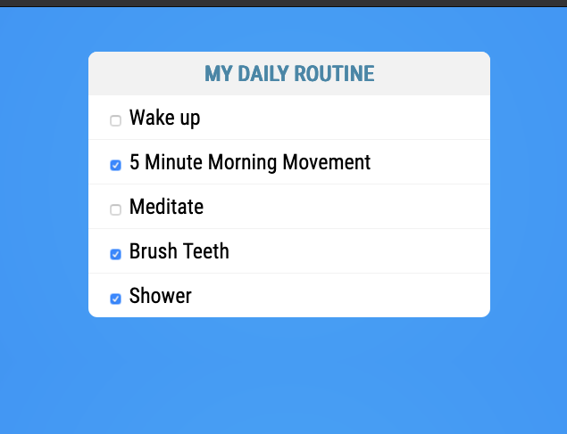
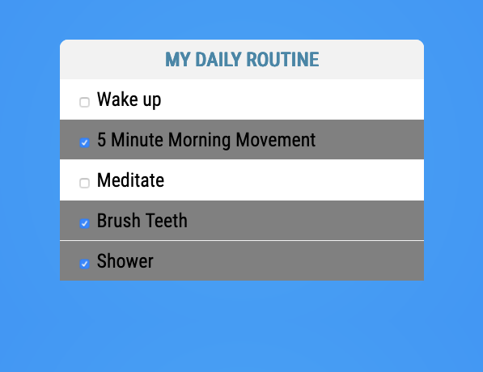
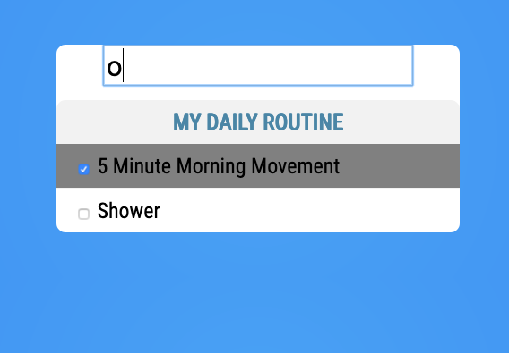

# Intro to Vue.js tutorial

In the reading material, you were introduced to Vue. In this tutorial, you'll write your first Vue Component and add it to an existing project. The project is located in this directory.

## Step One: Run `npm install`

If you remember from the student book, this is an existing project that has some dependencies that aren't stored in source control. To install your project's dependencies, run the following command:

```bash
npm install
```

## Step Two: Build out your `TodoList` component

Now, you'll build out a todo list component. Once you've built that component, you'll import it into your main application and display it on the screen. Then, you'll add functionality that exercises Vue's dynamic data binding features.

In your `components` folder, create a new file called `TodoList.vue`. A new component usually consists of three pieces:

* HTML: `<template></template>`
* JavaScript: `<script></script>`
* CSS: `<style></style>`

You can copy and paste the following code into your new component, or if you have the [Vetur Extension](https://github.com/vuejs/vetur) installed, you can type out `vue` and press `tab` to create this:

```html
<template>

</template>

<script>
export default {

}
</script>

<style>

</style>
```

Now start with building the markup for this component. You'll build out a todo list. You can copy and paste the following code inside of the `<template></template>` tag:

```html
<div class="todo-list">
    <h1>My Daily Routine</h1>
    <ul>
        <li>Wake Up</li>
        <li>5 Minute Morning Movement</li>
        <li>Meditate</li>
        <li>Brush Teeth</li>
        <li>Shower</li>
    </ul>
</div>
```

Next, paste the following CSS code between the `<style></style>` tag to give your list some style. Feel free to copy and paste this part instead of typing it all in:

```css
.todo-list {
    width: 450px;
    background: #fff;
    margin: 50px auto;
    font-family: 'Roboto Condensed', sans-serif;
    border-radius: 10px;
}
h1 {
    background: #f2f2f2;
    color: #4b86A6;
    padding: 10px;
    font-size: 24px;
    text-transform: uppercase;
    text-align: center;
    margin-bottom: 0px;
    border-top-left-radius: 10px;
    border-top-right-radius: 10px;
}
ul {
    list-style-type: none;
    margin: 0px;
    padding: 0px;
}
li {
    font-size: 24px;
    border-bottom: 1px solid #f2f2f2;
    padding: 10px 20px;
}
li:last-child {
    border: 0px;
}
```

At the moment, leave the `<script></script>` tags empty.

## Step Three: Add the new component to `App.vue`

Now that you've built your component, you need to display it on the screen. To use the component in your application, you need to import it first. Open `App.vue`, and at the beginning of your JavaScript section, add a new import line to import your new component:

```javascript
import TodoList from './components/TodoList';
```

Then add the component to the components section of the Vue object:

```javascript
components: {
  TodoList
}
```

Now that you've imported the component, you can use it in the HTML portion of the `App` component. The name of the component is `TodoList`. Follow the naming standard for components, which says that all custom-made HTML elements must be all lowercase and include a hyphen. This means that for this tutorial, the component is `<todo-list></todo-list>`:

```html
<template>
  <div id="todo-app">
    <todo-list></todo-list>
  </div>
</template>
```
If your component is a single word, like "Clock", you'll typically add an additional word such as "WebClock", and then apply the same naming rules as above, as in `<web-clock></web-clock>.`

## Step Four: Run your Todo application

If you run the application using `npm run serve` and visit http://localhost:8080, you'll see this:


## Step Five: Add data binding to your Todo application

Now that you've completed your basic Todo application, you can make it more dynamic by having the todo items in JavaScript data instead of hard-coded in the HTML of the component.

The first thing you need to do is open the `TodoList.vue` component and remove all of the hard-coded list items:

```html
<template>
    <div class="todo-list">
        <h1>My Daily Routine</h1>
        <ul>
        </ul>
    </div>
</template>
```

Next, create an empty array inside the return of the data function:

```javascript
<script>
export default {
  data() {
    return {
      todos: []
    }
  }
}
</script>
```

Then take the list items that you used before and add them to the todo array:

```javascript
<script>
export default {
  data() {
    return {
      todos: [
        {
          name: 'Wake up'
        },
        {
          name: '5 Minute Morning Movement'
        },
        {
          name: 'Meditate'
        },
        {
          name: 'Brush Teeth'
        },
        {
          name: 'Shower'
        }
      ]
    }
  }
}
</script>
```

Now that you have an array of todo items, it's time to display them in the list. To do this, use the `v-for` directive. Place the following code inside of the `<ul></ul>` tags in your template:

```html
<h1>My Daily Routine</h1>
<ul>
  <li v-for="todo in todos" v-bind:key="todo.name">{{ todo.name }}</li>
</ul>
```

You can now run the application using `npm run serve`. Visit http://localhost:8080 to see the same list you had before:


The difference now is that you aren't hard-coding the values in the markup. You created a todo array, and then, thanks to data binding, you were able to dynamically iterate over that array and display them in your list.

## Step Six: Add dynamic data with two-way data binding

Now, add checkboxes to each of the todo items so that todo items can be marked as completed. To do this, add a new data property to each of the todo items in the `data()` section of the component. Call it `done` and default it to `false`:

``` JavaScript
data() {
  return {
    todos: [
      {
        name: 'Wake up',
        done: false
      },
      {
        name: '5 Minute Morning Movement',
        done: false
      },
      {
        name: 'Meditate',
        done: false
      },
      {
        name: 'Brush Teeth',
        done: false
      },
      {
        name: 'Shower',
        done: false
      }
    ]
  }
}
```

Now, connect that to a checkbox next to each item. Create the checkbox in the `<li>` element and use `v-model` to connect it to the `done` property:

``` HTML
<li v-for="todo in todos" v-bind:key="todo.name">
  <input type="checkbox" v-model="todo.done" />
  {{ todo.name }}
</li>
```

If you run your project, you'll see that you can now check and clear the box next to the todo item.



## Step Seven: Data bind CSS classes on elements

Now, add in a new binding that sets a grey background color on the todo item when it's marked as `done`. You do this by binding the `done` property to toggle a class on the `<li>`.

First, create the class:

``` CSS
.finished {
  background-color: grey;
}
```

Then, in the `<li>` defined earlier, add the following `v-bind:class` to set the `finished` class to be added when `done` is true and removed when `done` is false:

``` HTML
<li v-for="todo in todos" v-bind:key="todo.name"
    v-bind:class="{ finished: todo.done }">
  <input type="checkbox" v-model="todo.done" />
  {{ todo.name }}
</li>
```

Remember that `v-bind` takes a JavaScript object where the names are the CSS classes to add, and the values are booleans that signify if the classes should be added or not. In the previous example, `finished` is the class to be added, and `todo.done` is the boolean data property that says whether it should be added (`true`) or not (`false`).

Clicking on the checkboxes now greys out the item in the list, and unchecking a box returns it to normal.



## Step Eight: Filter the Todo items

The last feature you'll add is the ability to filter the todo items so that you only show the items that match a user's search criteria. There are many steps to get this working, so work through each one in order.

First, capture the user's input by adding a new data property to the component called `filterText`:

``` JavaScript
data() {
    return {
      filterText: '',
      todos: [
        ...
```

Then bind that to an input field before the todo list:

``` HTML
<input type="text" v-model="filterText" />
<h1>My Daily Routine</h1>
```
Next, add CSS to lay out the input field:

``` CSS
input[type=text] {
  width: 75%;
  margin: auto;
  font-size: 2em;
  display: block;
}
```

Now, anything typed into the text field is put into the `filterText` data property.

To create a filtered list of items, you need to decide where the new list should live. The original list of items can't be changed because you don't want to lose items on the list—just temporarily filter them. If the filter text is empty, all items must be shown. If the filter text is set, use it to find the todos that contain that text.

This is best done with a `computed` property. The data property always contains all the todo items, and a computed property returns only a subset of that data property that matches the `filterText`.

Create the computed section of your component under the `data(){...}` section:

``` JavaScript
computed: {

}
```

Then write a method that returns an array of todos that contains the filter text. To access the component itself, use the `this` variable:

``` JavaScript
computed: {
  filteredTodos() {
    return this.todos.filter((todo) => {
      return todo.name.includes(this.filterText);
    });
  }
}
```

You can then use this new `filteredTodos` property rather than the `todos` property in your `v-for` loop:

``` HTML
<li v-for="todo in filteredTodos" v-bind:key="todo.name"
    v-bind:class="{ finished: todo.done }">
```

Now, you see a real-time, updated list of todos based on the text typed into the filter.



## Summary

In this tutorial, you:

- Learned how to create new component using HTML, JavaScript, and CSS
- Added a new component to a Vue project
- Used data binding to connect a component's UI and properties
- Used `v-for` to create a list in HTML from a JavaScript array
- Added a checkbox connected to a data property for dynamic updates
- Used `v-bind` to bind a data property to class attributes
- Used a computed property to dynamically modify data display
